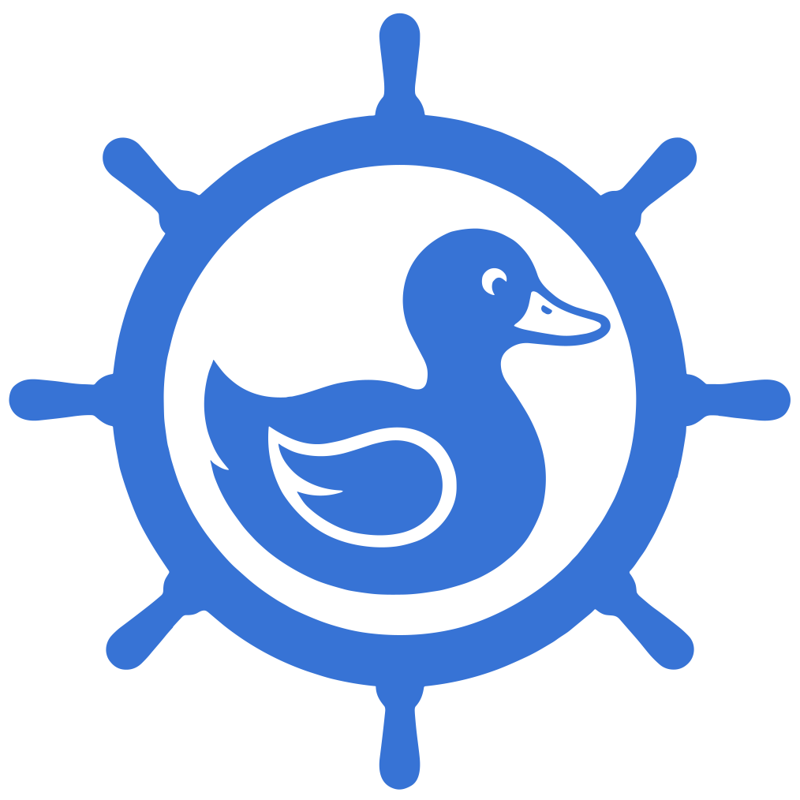
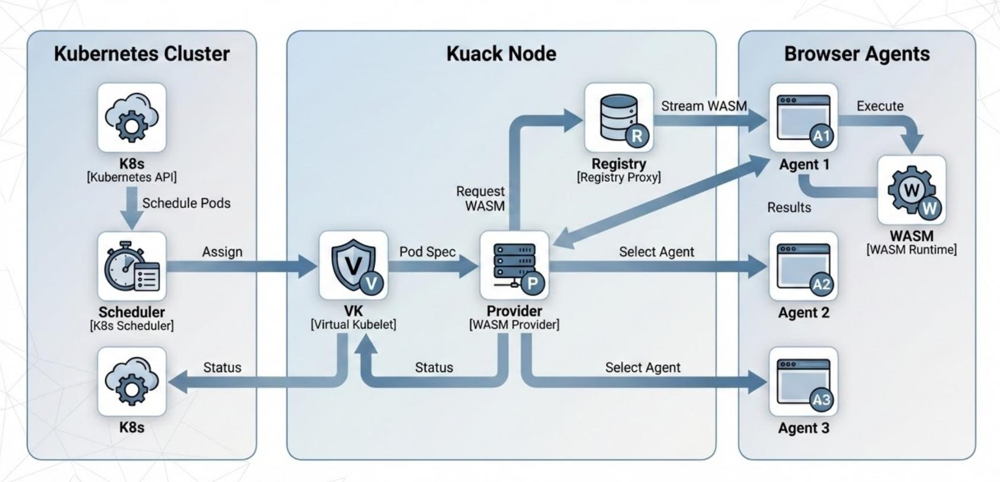

<div align="center">
  
</div>

# Kuack

> "If it looks like a Node, and it quacks like a Node... It's a Kuack Node!" 🦆

**Kuack** is a Virtual Kubelet provider that transforms browsers into Kubernetes worker nodes, enabling distributed computing at the edge using WebAssembly.

[](LICENSE)
[](https://github.com/kuack-io/kuack)

## What is Kuack?

Kuack enables Kubernetes to schedule WebAssembly (WASM) workloads to browser-based agents. Instead of running pods on expensive cloud servers, Kuack can execute them in users' browsers - turning millions of idle devices into a massive compute cluster.

### Key Features

- **Virtual Kubelet Integration**: Works with standard Kubernetes APIs
- **Multi-Platform Support**: Same image runs on Linux nodes and browser agents
- **Hybrid Orchestration**: Automatic fallback from browsers to servers
- **Zero Installation**: Works in any modern browser
- **Resource Aggregation**: Sums CPU, memory, and GPU from connected agents

## Architecture



## Quick Start

For a full walkthrough, see the [Quickstart](https://kuack.io/docs/quickstart) in the docs. At a high level:

1. **Install Kuack via Helm:**

   ```bash
   helm install kuack oci://ghcr.io/kuack-io/charts/kuack
   ```

2. **Expose Node and Agent services locally (for a quick test):**

   ```bash
   kubectl port-forward service/kuack-node 8081:8080
   kubectl port-forward service/kuack-agent 8080:8080
   ```

3. **Connect a browser agent:**

   Open <http://localhost:8080> in your browser. The Agent UI should appear. Point it at the Node WebSocket endpoint, for example `ws://127.0.0.1:8081` when using the port-forwards above. Use default token value to connect.

4. **Run the checker example Pod:**

   ```yaml
   apiVersion: v1
   kind: Pod
   metadata:
     name: checker
   spec:
     nodeSelector:
       kuack.io/node-type: kuack-node
     tolerations:
       - key: "kuack.io/provider"
         operator: "Equal"
         value: "kuack"
         effect: "NoSchedule"
     containers:
       - name: checker
         image: ghcr.io/kuack-io/checker:latest
   ```

   Apply it and then stream logs:

   ```bash
   kubectl apply -f checker.yaml
   kubectl logs -f checker
   ```

This uses a multi-arch image that can run both on regular nodes and in browsers. Just remove the `nodeSelector` to run the same on the regular node.

## How It Works

### 1. Agent Connection

Browser agents connect to the Kuack Node via WebSocket, reporting available resources (CPU, memory, GPU).

### 2. Resource Aggregation

The Node sums resources from all connected agents and presents them to Kubernetes as a virtual node.

### 3. Pod Scheduling

Kubernetes schedules WASM-compatible pods to the virtual node. The Node selects an available agent.

### 4. WASM Execution

The agent downloads the WASM binary from the Registry Proxy and executes it in the browser.

### 5. Results

Execution results and logs stream back to Kubernetes via the Node.

## Ecosystem

Kuack consists of multiple components:

- **[node](https://github.com/kuack-io/node)**: Virtual Kubelet provider (Go)
- **[agent](https://github.com/kuack-io/agent)**: Browser agent library (TypeScript)
- **[helm](https://github.com/kuack-io/helm)**: Helm chart for deployment
- **[checker](https://github.com/kuack-io/checker)**: Example WASM application (Rust)
- **[docs](https://github.com/kuack-io/docs)**: Documentation repository

## Limitations

Kuack is designed for specific workload types:

- Stateless workloads
- CPU-intensive tasks
- Short-lived jobs
- WASM-compatible code

It's **not an option** for:

- Stateful services (databases, caches)
- Long-running services
- Privileged operations
- Network services (listening on ports)

See [Limitations](https://kuack.io/docs/browser-runtime) for complete details.

## Contributing

Contributions are welcome! Areas where help is needed:

- Documentation improvements
- Additional example applications
- Bug fixes and stability improvements
- Feature implementation

## License

Licensed under the Apache License, Version 2.0. See [LICENSE](LICENSE) for details.

## Links

- **Website**: <https://kuack.io>
- **Documentation**: <https://kuack.io/docs>
- **Helm Chart**: <https://github.com/kuack-io/helm>

## Status

🚧 **Early Development**: Kuack is currently a proof of concept. Not recommended for production workloads yet.

## Why Kuack?

The name combines "Kubernetes" (K8s) with "Quack" (duck sound), referencing the "duck test": *"If it looks like a duck and quacks like a duck, it's probably a duck."* In our case: if it looks like a Kubernetes node and behaves like a Kubernetes node, it's a Kuack node!

---

**Made with 🦆 by the Kuack team**
